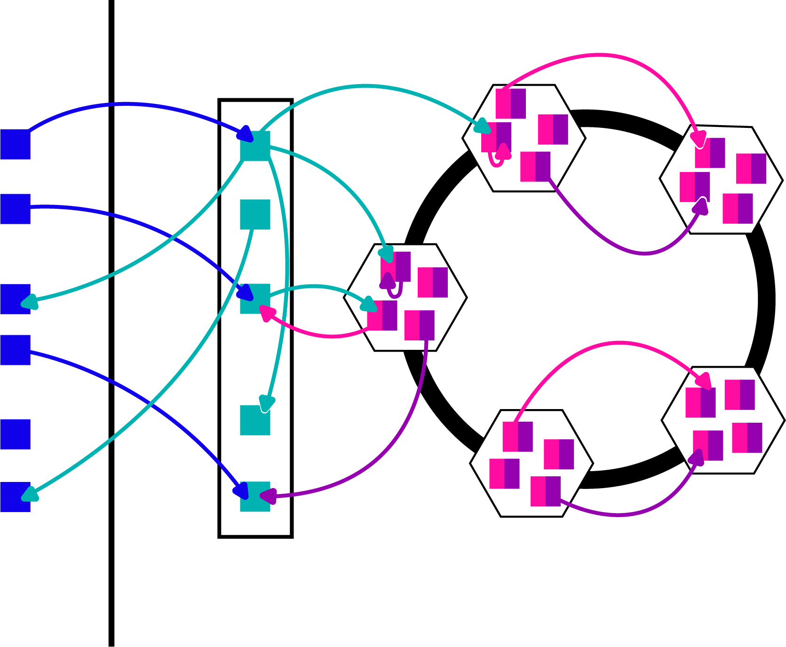

# 
Tweeter Distribuído 📱

## Equipo:
- Lazaro Daniel González Martínez
- Alejandra Monzón Peña
- Leonardo Ulloa Ferrer

## Funcionalidades del Sistema

Dweeter (Distributed Tweeter), es una red social que permite a los usuarios compartir textos en sus perfiles y otra operaciones similares a las que se pueden realizar en la bien conocida aplicación de Tweeter. 

Las acciones que pueden realizar los usuarios son: 

>- Registrarse en el sistema
>- Loggearse
>- Publicar un Dweet
>- Re-publicar un Dweet
>- Seguir a otro usuario
>- Ver el perfil de algún usuario
>- Pedir nuevos Dweets
>- Cerrar sesión

#### Registrarse en el sistema 

Para registrarse el usuario debe proveer un **Nombre**, un **Nick** que ha de ser único y por el que se le identificará por los restantes usuarios para poder seguirlo y ver su perfil, y una **Contraseña**. 

La acción de un usuario de registrarse será exitosa si el **Nick** que escoja no está en uso, en caso contrario recibirá un mensaje informándole que debe buscar otro Nick.

#### Loggearse 
La acción de loggearse requiere que el usuario esté registrado en el sistema, para loggearse el usuario debe poner su **Nick** y **Contraseña**, si 
los datos son introducidos correctamnete el loggeo será exitoso, en caso que la contraseña no se corresponda con el Nick o que el Nick no esté registrado se informará al usuario con un mensaje de combinación de Nick/Contraseña incorrecta.

Para poder publicar, seguir, re-publicar, ver perfiles y pedir visualizar Dweets el usuario debe estar loggeado en el sistema.

#### Publicar Dweet 
Publicar un Dweet requiere que el ususario introduzca en texto de la publicación, el cual no debe exceder los 225 caracteres.

Si el usuario está loggeado y el Dweet cumple las restricciones de tamaño, entonces se publicará el Dweet y este se agregará a su perfil.

#### Re-publicar un Dweet 
La acción de re-publicar un Dweet requiere que el usuario seleccione un Dweet existente, cuando esté viendo las publicaciones de otros usuarios si desea que esta se agregue a su perfil y que sea vista por sus seguidores puede optar por hacer un Re-Dweet.

#### Seguir un usuario

Un usuario para seguir a otro debe conocer su **Nick** y decir que quiere comenzar a seguir a ese usuario, si el Nick del usuario al que quiere seguir exisre, se comenzará a seguir a este usuario. Seguir a un usuario implica que cuando se pida ver nuevos Dweets las publicaciones y re-publicaciones de este usuario van a eventualmente aparcer, manteniendote al tanto de su contenido.

#### Ver perfil
Para ver un perfil se debe introducir el **Nick** del usuario cuyo perfil se desea ver, esto mostrará todos los Dweets y ReDweets hechos por este usuario. 

#### Pedir nuevos Dweets
Esta acción muestra un conjuto de Dweets y ReDweets de usuarios a los que estás siguiendo, es una acción que mientras mas veces se repita más cantidad de contenido podrás visualizar e informarte de publicaciones que aun nohayas visto.

#### Cerrar Sesión 

Es la forma segura de salir de la red social y que nadie pueda acceder a tu cuenta a menos que conozca el **Nick** y **Contraseña** correspondientes para loggearse nuevamente.

### Interacción con Dwitter

El usuario para poder realizar todas las acciones disponibles utilizará una consola interactiva de apariencia sencilla y fácil uso.

## Almacenamiento de información

Para almacenar la información se utilizó una base de datos relacional en SQLite, el diseño de la misma y las operaciones de inserción, consulta, eliminación de datos se manejó con la librería `Pewee` de `Python`, que funciona muy similar a la ORM de Django.

### Almacenamiento distribuído

Como los servidosres de datos (*TweeterServers*) están dispuestos en froma de anillo y se comunican para buscar los recursos mediante una *DHT* con un algoritmo *Chord*, entonces se aprovecha el identificador de cada Nodo del Chord para repartir la información a almacenar. Como en el algoritmo Chord cada Nodo responde por los recursos que tengan identificador menor que el de dicho Nodo y mayor que el de su antecesor en la DHT, y aprovechando las caracteristicas propias de las Redes Sociales, en que todo requiere de un usuario registrado para poder intercambiar, utilizamos la misma función de *hash* con la que se decidió el identificador del Nodo para hashear los Nicks de los usuarios, de modo que todos los recursos (publicaciones, Nicks de a quienes sigue, Datos de loggeo, etc) relativos a usuarios con identificador en el mismo segmento del chord se encuentra en un mismo Nodo; mientras que usuarios con identifiador en dos secciones diferentes den anillo del chor tienen sus datos almacenados en Nodos diferentes. 

Con esta forma de distribuir los datos, mientras más crezca el número de usuarios de Dweeter, mayor cantidad de Nicks de usuario existirán y más equilibrada estará la cantidad de información almacenada en cada uno de los Nodos.

## Tipos de Servidores y arquitectura de la Red

En el sistema distribuído Dweeter, exiten 4 tipos de servidores, cada uno con un comportamiento y funcionalidades específicas en la red.

>-  ClientServer
>-  EntryServer
>-  ChordServer
>-  TweeterServer

Cada computadora de la red tiene alguno de estos comportamientos asignados y en base a esto se establecen los protocolos de comunicación entre ellos para el manejo de datos.

A continuación explicamos con mayor detalle las funcionalidades y comportamiento de cada tipo de servidor.

#### ClientServer

#### EntryServer

#### ChordServer

#### TweeterServer
Este servidor es el encargado de trabajar con la base de datos y buscar que todo lo pedido por el usuario sea consistente: 

- Que el usuario esté loggeado en las acciones que lo requieran
- Que al usuario al que quieran seguir exista
- Que el Dweet que quieran ReDweetear exista
- Que al momento de loggearse sea correcta la información de Nick y Contraseña
- Que al registrarse el Nick de usuario sea único

Además de guardar en la base de datos los Dweets y ReDweets, nuevos Usuarios, Tokens de usuarios Loggeados, etc. 

Para todo este manejo de la base de datos 

## Comunicación de Servidores

